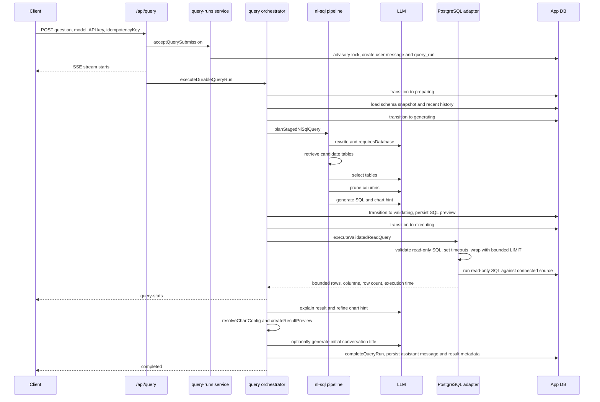

# Query Pipeline Architecture

Current as of 2026-06-19. This artifact describes the active V2 query path used by `/api/query`, based on the local working tree.


## Active Request Flow

```mermaid
flowchart TD
  UI[Conversation UI] -->|POST /api/query<br/>Accept: text/event-stream| Route[app/api/query/route.ts]
  Route --> Validate[Validate body<br/>conversationId, question, provider, model, apiKey, idempotencyKey]
  Validate --> Accept[acceptQuerySubmission]
  Accept --> Lock1[Advisory lock by user, conversation, idempotency key]
  Lock1 --> Existing{Existing query run?}
  Existing -->|yes| ReturnExisting[Return existing run DTO]
  Existing -->|no| PersistUser[Persist user message<br/>Create query_run<br/>Link message to run]
  PersistUser --> SSE{SSE requested?}
  SSE -->|yes| Stream[querySseResponse]
  SSE -->|no| Blocking[Blocking JSON response]
  Stream --> Durable[executeDurableQueryRun]
  Blocking --> Durable

  Durable --> Preparing[Status: preparing]
  Preparing --> LoadCtx[Load schema snapshot and recent conversation history in parallel]
  LoadCtx --> Generating[Status: generating]
  Generating --> Plan[planStagedNlSqlQuery]

  Plan --> Rewrite[LLM 1: rewrite follow-up and decide requiresDatabase]
  Rewrite --> NeedsDb{requiresDatabase?}
  NeedsDb -->|no| TitleConv[Optional LLM title generation]
  TitleConv --> PersistConversation[Persist assistant conversational response]
  PersistConversation --> DoneConversation[Emit completed]

  NeedsDb -->|yes| Retrieve[Deterministic table retrieval]
  Retrieve --> SelectTables[LLM 2: select relevant tables]
  SelectTables --> PruneColumns[LLM 3: prune columns]
  PruneColumns --> GenerateSql[LLM 4: generate SQL and initial chart hint]
  GenerateSql --> ValidateSql[Status: validating<br/>Persist generated SQL preview]
  ValidateSql --> Execute[Status: executing<br/>executeValidatedReadQuery]
  Execute --> Db[(PostgreSQL)]
  Db --> QueryStats[Emit query-stats]
  QueryStats --> Explain[LLM 5: explain result and chart hint]
  Explain --> RenderChart[resolveChartConfig locally]
  RenderChart --> Preview[createResultPreview]
  Preview --> TitleQuery[Optional LLM title generation]
  TitleQuery --> PersistResult[Status: persisting<br/>Persist assistant message, query_run result, preview, chart config]
  PersistResult --> DoneQuery[Emit completed]
```



## Query Branch Sequence



## Current Latency Profile From Local Logs

Observed query run: `572de4cc-605b-4ed4-9ade-cb690354f58a`, total duration `78,348 ms`.

| Stage | Duration | Notes |
| --- | ---: | --- |
| Context loaded | 603 ms | Schema snapshot plus recent history. |
| Rewrite | 21,533 ms | First LLM call. Also decides database vs conversation mode. |
| Retrieval | 305 ms | Local/deterministic table candidate retrieval. |
| Table selection | 13,861 ms | Second LLM call. |
| Column pruning | 4,068 ms | Third LLM call. |
| SQL generation | 3,651 ms | Fourth LLM call. |
| Planning total | 43,434 ms | Sum of staged NL-to-SQL planning. |
| SQL execution wrapper | 5,760 ms | Includes adapter, pool, validation, network, and DB execution. |
| Reported DB execution | 2,428 ms | Value returned by query execution result. |
| Explanation | 23,347 ms | Fifth LLM call. Also returns chart hint. |
| Persistence | 1,909 ms | Assistant message, query run fields, preview, metadata. |

## Why It Feels Slow

The user-facing answer waits for a mostly serial chain:

```text
accept submission
  -> load schema/history
  -> LLM rewrite
  -> table retrieval
  -> LLM table selection
  -> LLM column pruning
  -> LLM SQL generation
  -> SQL execution
  -> LLM result explanation
  -> optional LLM title generation
  -> persistence
  -> completed event
```

The chart selection itself is not the expensive part. `resolveChartConfig` is local. The expensive chart-related work is the post-query explanation LLM call, which can also return or refine the chart hint.

## Main Components

| Component | Responsibility |
| --- | --- |
| `app/api/query/route.ts` | Validates request, accepts query submission, chooses SSE or JSON execution. |
| `lib/v2/query-runs/service.ts` | Handles idempotency, user message persistence, query-run state transitions, completion/failure. |
| `lib/v2/query/orchestrator.ts` | Coordinates durable execution, status events, schema/history loading, NL-to-SQL planning, SQL execution, explanation, chart config, title generation, and persistence. |
| `lib/v2/nl-sql/pipeline.ts` | Runs the staged NL-to-SQL LLM chain. |
| `lib/v2/query/runtime.ts` | Loads generation schema and delegates read-only query execution to the data-source adapter. |
| `lib/v2/data-sources/postgresql/adapter.ts` | Validates SQL, enforces read-only transaction and timeouts, executes bounded query. |
| `lib/llm/structured.ts` | Shared structured object generation wrapper. |
| `lib/llm/client.ts` | Provider/model construction, retries, and model fallback behavior. |

## Important Behavioral Notes

- Query submission is durable and idempotent by `ownerUserId`, `conversationId`, and `idempotencyKey`.
- The user message and query-run record are persisted before external LLM and database work starts.
- Query status changes are persisted and streamed.
- Schema and recent history are loaded in parallel.
- SQL execution is bounded by timeout, max rows, max bytes, and read-only validation.
- Result previews are persisted separately from the full result.
- The latest local working tree includes optional generated conversation titles after the assistant response is known.

## Optimization Targets

1. Replace the staged NL-to-SQL chain with the constrained single-agent flow described in `AGENT_ARCHITECTURE.md`.
2. Remove or make conditional the LLM table-selection and column-pruning stages for small schemas.
3. Merge explanation and chart selection into the same agent turn that receives query results.
4. Make title generation fully asynchronous so it never blocks query completion.
5. Add stage duration events to the SSE stream or expose them in dev UI to make slow stages obvious without reading logs.
