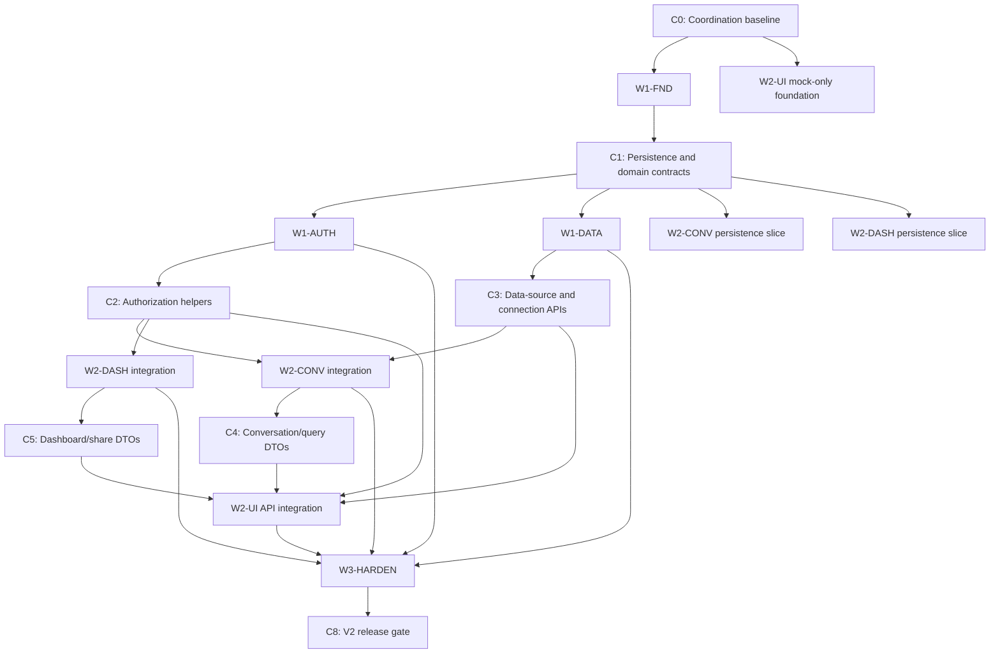

# QueryWise V2 Dependency Graph

This graph converts the V2 specs into executable workstreams with explicit
entry gates, publication gates, and integration checkpoints. A dependency is
satisfied only when the producer records evidence in its work log and publishes
the named contract or artifact. A passing build alone does not satisfy a gate.

## Workstream IDs

| ID | Workstream | Primary output |
| --- | --- | --- |
| `W0-COORD` | Coordination and contract control | ownership, gates, prompt standard, contract ledger |
| `W1-FND` | Application database and shared foundation | PostgreSQL app DB, migrations, shared domain/DAL contracts, encryption |
| `W1-AUTH` | Clerk authentication and authorization | identity, private-route protection, resource authorization helpers |
| `W1-DATA` | Connections and SQL data-source adapter | saved connections, PostgreSQL adapter, canonical metadata snapshots |
| `W2-CONV` | Conversations and query runs | durable chat, query execution orchestration, persisted runs |
| `W2-DASH` | Dashboards and sharing | durable dashboards, widgets, grants, public/password shares |
| `W2-UI` | V2 workspace UI | private shell, connection/conversation/dashboard UI, API clients |
| `W3-HARDEN` | Production hardening and verification | limits, audit, jobs, integration/security/load verification |

## Dependency Graph

## Checkpoints And Gates

### C0: Coordination Baseline

Owner: `W0-COORD`

Required before implementation agents edit code:

- all agents accept `OWNERSHIP_MATRIX.md`
- all agents use `AGENT_PROMPT_STANDARD.md` and create their own work log
- contract changes follow `CONTRACT_CHANGELOG.md`
- PostgreSQL is the only V2 implementation; product modules target
  capability-based SQL adapters and canonical relational metadata
- no workstream edits another workstream's paths without a recorded handoff

### C1: Persistence And Domain Contracts

Producer: `W1-FND`

Required artifacts:

- migration tool and commands for a separate PostgreSQL application database
- initial migrations for all required V2 entities
- server-only application DB client and transaction API
- shared IDs, records, safe DTOs, pagination, and typed error contracts
- versioned authenticated-encryption API and environment-variable names
- repository conventions that prohibit unrestricted private-resource `getById`
- focused migration, encryption, DTO-leak, owner-scope, and rollback tests

Unblocks:

- `W1-AUTH`, `W1-DATA`
- persistence-only slices of `W2-CONV` and `W2-DASH`

### C2: Authorization Helpers

Producer: `W1-AUTH`; requires `C1`

Required artifacts:

- Clerk provider and current Next.js 16 route-protection strategy
- `requireUser`, `requireOwnedConnection`, `requireConversationAccess`, and
  `requireDashboardAccess`
- private-not-found behavior and public-share bypass boundary
- cross-user and unauthenticated tests

Unblocks:

- private feature route integration in `W1-DATA`, `W2-CONV`, and `W2-DASH`
- authenticated server-data integration in `W2-UI`

### C3: Data-Source And Connection Contracts

Producer: `W1-DATA`; requires `C1` and consumes `C2` for private routes

Required artifacts:

- adapter registry, capabilities, `ProviderQuery`, and typed capability errors
- PostgreSQL-only adapter implementation hidden behind the registry
- canonical metadata and safe schema DTO mappings
- saved-connection service/API using `connectionId`, never connection URLs
- encrypted-secret resolution and pool lifecycle keyed by `connectionId`
- query validation/read-only execution, row cap, timeout, SSRF policy, and tests

Unblocks:

- `W2-CONV` query integration
- connection and schema integration in `W2-UI`

### C4: Conversation And Query Contracts

Producer: `W2-CONV`; requires `C1`, `C2`, and `C3`

Required artifacts:

- conversation/message/query-run repositories and compact cursor DTOs
- `/api/conversations/**` and V2 `/api/query` request/response/event contracts
- transactional success and consistent failure persistence behavior
- bounded result previews and persisted follow-up context
- tests proving no connection substitution, secret persistence, or cross-user access

Unblocks:

- conversation/query integration in `W2-UI`
- query-run references in `W2-DASH`
- query-path verification in `W3-HARDEN`

### C5: Dashboard And Share Contracts

Producer: `W2-DASH`; requires `C1` and `C2`; consumes `C4` when query-run
references are available

Required artifacts:

- dashboard/widget/grant/share repositories and compact DTOs
- owner-only mutations and narrowly scoped public-share read path
- hashed tokens/passwords, revoke/expiry behavior, and safe shared DTOs
- tests for access grants, public/password links, expiry, revocation, and leaks

Unblocks:

- dashboard/share integration in `W2-UI`
- sharing verification in `W3-HARDEN`

### C6: UI Integration Checkpoint

Producer: `W2-UI`; requires `C2` through `C5`

Required artifacts:

- V2 private route group and three-column shell
- client/API modules consuming published DTOs without redefining them
- durable server data as source of truth; browser storage only for transient UI
- responsive, loading, error, empty, keyboard, and focus behavior
- no credentials, raw private records, or full conversations in browser storage

### C7: Cross-Feature Verification Checkpoint

Owner: `W3-HARDEN`; requires feature APIs and an integrated UI path

Required scenarios:

1. Sign in, create/test a connection, and persist a schema snapshot.
2. Create a conversation, run a safe query, reopen it, and ask a follow-up.
3. Save a query result to one of multiple dashboards.
4. Share a dashboard by direct grant, public link, and password link.
5. Prove cross-user private-resource access fails without disclosing existence.
6. Prove public share DTOs expose no credentials, schema, or conversation data.
7. Prove query, schema refresh, connection test, and password attempts are bounded.
8. Exercise customer DB, app DB, LLM, encryption, and partial-write failures.

### C8: Release Gate

V2 is release-ready only when:

- all checkpoint evidence is recorded in owning work logs
- accepted contract changes are integrated by all listed consumers
- focused tests, security/integration tests, and `npm run build` pass
- every important non-UI change is reflected in
  `docs/ENGINEERING_SYSTEM_DESIGN_NOTES.md`
- each commit is atomic, scoped, and contains only owned/coordinated files

## Parallelism Rules

- `W2-UI` may build mock-only components after `C0`, but may not invent or
  publish backend contracts.
- `W2-CONV` and `W2-DASH` may implement persistence slices after `C1`; route
  integration waits for `C2`, and query execution waits for `C3`.
- `W3-HARDEN` may prepare test harnesses early, but fixes in feature-owned paths
  require a handoff to the feature owner.
- A consumer may code against a proposed contract only on an isolated branch and
  must not merge until the coordinator records acceptance.

